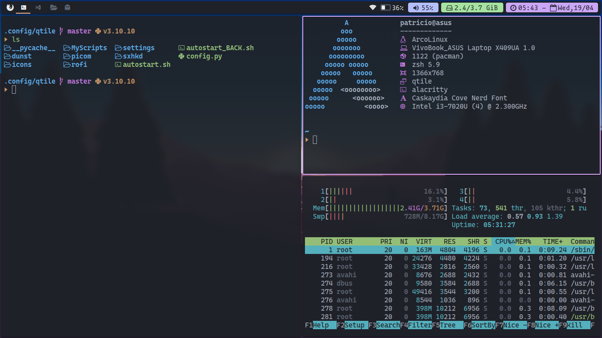

# Dotfiles & Configs




| Title                | Description                |
| -------------------- | -------------------------- |
| **Distro**           | Arco Linux                 |
| **Window Manager**   | Qtile Extras               |


# Qtile Basic Settings

Now that you're in Qtile, you should know some of the default keybindings.

| Key                  | Action                     |
| -------------------- | -------------------------- |
| **mod + return**     | launch alacritty           |
| **mod + k**          | next window                |
| **mod + j**          | previous window            |
| **mod + w**          | kill window                |
| **mod + [12345]**    | go to workspace [12345]    |
| **mod + ctrl + r**   | restart qtile              |
| **mod + ctrl + q**   | logout                     |

The version of qtile I am using is qtile-extras, for arch based systems you can use `paru` or `yay`:

```bash
yay qtile-extras-git
```

In addition to that you must install `dbus-next` with pip, for the battery icon to work:
```bash
pip install dbus-next
```

Install terminal emulator

```bash
# Install another terminal emulator if you want
sudo pacman -S alacritty
```

Install a program launcher like dmenu or rofi:
```bash
sudo pacman -S rofi
```


# Network

To connect to a network you can use `nmcli`, but you must first install it in case you don't have it on your pc
```bash
pacman -S networkmanager
```

Once done do the following

```bash
sudo pacman -S networkmanager
```

Once done do the following,  to connect to a network

```bash
# List all available networks
nmcli device wifi list
# Connect to your network
nmcli device wifi connect YOUR_SSID password YOUR_PASSWORD
#For more information
man nmcli
```


Or you can do it through a graphical interface
```bash
sudo pacman -S network-manager-applet 
```

# Notifications
To have notifications on the desktop you must install `dunstify`

```bash
sudo pacman -S dunstify
```


